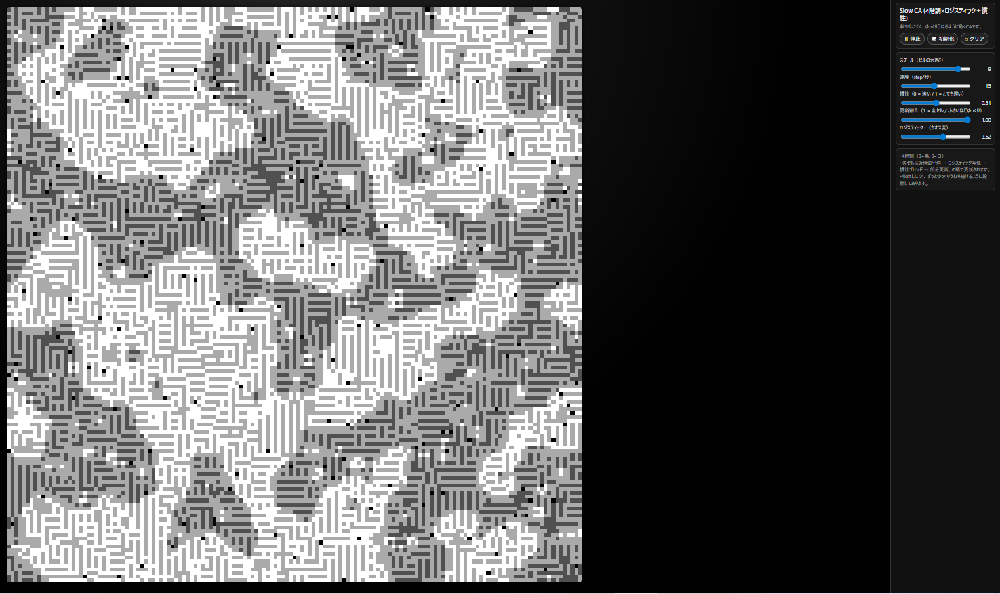

Slow CA（4階調ロジスティック・スキン）

  

Slow CA は、4値セルオートマトンに
近傍平均 × ロジスティック写像 × 慣性 を組み合わせた実験作です。

マクロでは：雲・皮膚・地形のような「自然物っぽい」濃淡

ミクロでは：迷路・ノイズ・斑点のような「チューリングパターン的なキモさ」

が同時に現れ続ける、「生き物の表面」みたいな動きを狙っています。

🔗 実行ページ

https://masato-nasu.github.io/REMMA-CA/

スマートフォンのブラウザで開くと、
「ホーム画面に追加」で PWA（インストール型アプリ） として使えます。

SCREENSHOT

screenshot.png

本リポジトリのルートに配置。

おすすめプリセット（スケール 9 / 速度 10〜15 / 慣性 0.5 前後 / 更新割合 1.0 / r=3.6〜3.7）で得られる
「雲＋迷路＋チューリングもどき」が同居した状態の一例です。

README 冒頭の  で参照しています。

必要に応じて、screenshot2.png などを追加して、
別パラメータの相（ノイズ寄り／雲寄りなど）をギャラリー的に増やしても構いません。

🧮 仕組み

盤面は N×N のグリッドで、各セルは 0〜3 の 4値 を取ります。

0 … 黒

1 … 濃い灰

2 … 薄い灰

3 … 白

1ステップの更新は、概ね次のように行われます：

近傍平均（平滑化）
各セルについて、3×3 近傍の値の平均 m（0〜3）を計算します。

ロジスティック写像（カオス）

u = m / 3 で 0〜1 に正規化

u' = r * u * (1 - u) （r は 3.0〜4.0 の範囲でスライダー指定）

u' を 0〜1 にクリップして、v = floor(u' * 4) として 0〜3 に量子化

慣性ブレンド（ゆっくり動かす）

前の状態 oldV と新しい候補 v を
mixed = (1 - α) * oldV + α * v で混ぜ、丸めて 0〜3 に戻します。

α（アルファ）は「慣性」スライダーで指定（大きいほど“ねっとり遅く”変化します）。

部分更新（確率で据え置き）

各セルについて、確率 p で新しい値に更新し、
1 - p の確率では あえて前の値を残します。

p は「更新割合」スライダーで指定します。
→ これにより、局所的な“粘性”が生まれ、全体が皮膚のようにうごめきます。

黒のリシード（v2）

盤面全体の黒セル（値0）が一定割合より少なくなると、
いくつかのセルをランダムに黒へ戻します。

完全に真っ白に収束してしまうのを防ぎ、
ずっと少し曇ったような状態を保つための仕掛けです。

状態は常に 0〜3 の 4値離散CA ですが、
更新ルール内部では一度 連続値（0〜1） に持ち上げてロジスティック写像を通すため、
見た目は連続系に近い、流体的なパターンになります。

🔤 レンマの論理との関係

この CA は、以前に試作した Lemma-Driven CA（レンマ駆動セルオートマトン） から着想を得ていますが、

本家 Lemma-Driven CA のように
「3×3 近傍パターンごとのレンマ辞書（名前付きルール）」は持っていません。

各 3×3 近傍は、平均値 m という 1つの連続値に圧縮され、
その値に対して同じロジスティック写像＋慣性ルールが適用されます。

その意味で、これは

「レンマの論理（局所文脈に応じた変化）」を、
パターン辞書ではなく 連続関数として実装したバリエーション

と位置づけています。

状態の 4値を、例えば

0 = XX

1 = XO

2 = OX

3 = OO

のような 2ビット状態として解釈することもできますが、
更新ルール自体はこの 2ビット論理を厳密に分けて扱ってはいません。
あくまで「4段階の状態が連続的にゆらぐ CA」として設計しています。

🕹 操作方法

右側のコントロールパネルから挙動を調整できます。

ボタン

▶ 再生 / ⏸ 停止
シミュレーションのオン・オフ切り替え。

🎲 初期化
ランダムな初期状態にリセット。

□ クリア
全セルを 0（黒）にリセット。

スライダー

スケール（セルの大きさ）
1セルあたりのピクセル数。
大きくすると粗いドットになり、大きな構造が見やすくなります。

速度（step/秒）
更新速度。
5〜15 あたりが「生き物っぽく」見えやすいです。

慣性（0 = 速い / 1 = とても遅い）
新しい値にどれだけ寄せるかを決めるパラメータ α。

0.3〜0.6：雲と迷路が混ざる「ほどよい」相

0.8〜1.0：全体がノイズ寄りの相になりやすいです。

更新割合（1 = 全セル / 小さいほどゆっくり）
1.0 なら全セルを更新、0.3 なら 30% だけ更新します。
値を下げるほど、「局所だけじわじわ変わる」ような粘性が出ます。

ロジスティック r（カオス度）
ロジスティック写像 u' = r u (1-u) のパラメータ。

3.0〜3.4：比較的おとなしい／収束寄り

3.6〜3.8：カオスと秩序の境目（雲＋迷路＋ノイズが同居しやすい）

4.0 付近：ほぼ純粋なノイズになります。

🔍 おすすめプリセット（雲＋迷路相）

迷路っぽいテクスチャと
雲のような大きな構造が同時に出る相の一例：

スケール：9

速度：10〜15

慣性：0.5 前後

更新割合：1.0

ロジスティック r：3.6〜3.7

このあたりで回すと、
スクリーンショットのような 「雲＋チューリングもどき」 が、
ゆっくりと形を変えながら生き物のように動き続けます。

Slow CA は、
「完全な秩序でもカオスでもない、そのあいだの揺らぎ」 を眺めるための小さな装置です。
気に入ったパラメータやスクリーンショットが得られたら、
その設定ごと作品として保存してもらえると嬉しいです。
